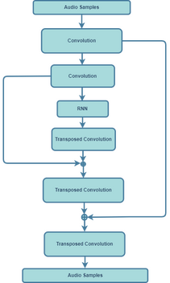

# BandwidthExtension

[Bandwidth extension](https://en.wikipedia.org/wiki/Bandwidth_extension) of the signal is defined as the deliberate process of expanding the frequency range (bandwidth) of a signal in which it contains an appreciable and useful content and/or the frequency range in which its effects are such.

##### Google Colab file for inference using a pretrained model for Non-Polyphase based Model
> Model was trained for 16kHz input audio samples and 32kHz target audio samples using WMSE as a loss function
 

##### A small website for input, target and generated audio samples.
[BandwidthExtension](https://mukul74.github.io/BandwidthExtensionAudioSamples/)

## Abstract
  >Advancements in the field of deep learning have led to some remarkable discoveries in
 the field of audio processing. A plethora of resources makes it possible to implement them
 and supplies the opportunity to present a better version of previously developed algorithms and methods. In this thesis, we present an implementation of Bandwidth Extension for audio using generative models with the help of an end-to-end based deep learning model using the Pytorch deep learning library.

>With the use of deep learning-based study, we have studied multiple neural network models, with variations in the input data to the model, for a better understanding of the underlying structure in the audio data and how the structure can be exploited for best results. In addition to that, models were trained against different loss functions. Loss functions play a huge role in supplying better results. One of the loss functions we considered was based on the perception of sound by the human ear, known as Weighted Mean Square Error(WMSE) because generic loss functions such as Mean Squared Error(MSE) are insufficient for audio synthesis. Hence including perception-based error function proves to be better than MSE and provides a better reconstruction of high-frequency components than MSE-based reconstruction. Another error function that generated better results was Log Spectral Distance(LSD). It was compared with the other loss functions across Polyphase and Non-Polyphase based RNN-Autoencoder.

> Models considered for this evaluation are SampleRNN and an RNN Autoencoder, which utilizes Resnet. Multiple experiments for bandwidth extension were performed for various sampling rates. Sampling rates considered for these experiments are 4 kHz to 8kHz, 8 kHz to 16 kHz, and 16kHz to 32 kHz. Predicted higher frequency components from low-frequency components were confirmed by looking at reconstructed spectrograms. In addition, a Mushra Test was performed to evaluate the quality of reconstructed audio samples for 8kHz as input and 16kHz as a target for the experiments mentioned above. As per Mushra test and spectrograms, Non-Polyphase based RNN-Autoencoder using WMSE as an error function proved to be closest to target audio data. 

## Block Diagram

## Models Examined 
1. Modified Unconditional SampleRNN
2. RNN-Autoencoder
    1. Non-Polyphase based RNN-Autoencoder
    2. Polyphase based RNN-Autoencoder
## Errors Examined
1. Mean Square Error(MSE)
2. Weighted Mean Square Error(WMSE)
3. Logarthmic Spectral Distance(LSD)

##### Google Colab file for error comparision

|      | Original vs Reconstructed | Original vs White Noise Corrupted |
|------|---------------------------|-----------------------------------|
| MSE  |          0.01886          |              0.01886              |
| WMSE |          1.46956          |              35.06760             |
| LSD  |          0.89329          |              2.47500              |

### Observation
1. MSE for both of the cases is same and is not able to diffrentiate between them, on the other hand, WMSE and LSD is able to diffrentiate between the white noise corrupted audio and Reconstructed audio.

2. The image shows audio samples generated via Perceptual Audio Coder and and White Noise corrupted by same SNR as of input and audio coder reconstructed.

## Modified Unconditional SampleRNN
 
#### Details
> A multi-scale RNN implementation helps to gather essential relationships among data, and we may train them on small samples for memory optimization. SampleRNN, unlike WaveNet, is a recurrent model. Recurrent cells, such as LSTMs or GRUs, can potentially spread meaningful information across indefinite time horizons. Discovering latent features over extended periods is difficult for LSTMs. It is primarily due to diminishing or exploding gradients. The basic concept driving SampleRNN is that audio shows prominent patterns at different timeframes and that these trends and features are constructed hierarchically. 
## RNN-Autoencoder

### Non-Polyphase based RNN-Autoencoder 
  
#### Details
> After testing a simple one-layer RNN-Autoencoder, a more complex rnn autoencoder was implemented, with transposed convolution as an upsampling technique. We are keeping the encoder part of the rnn-autoencoder made of convolutional layers. The idea of Resnet was also extended in this model. The main idea behind providing residual connections is to help the model learn better for upsampling and use the learned features while downsampling. Since the input is raw audio data, a block length of 1024 samples was considered to have a 50\% overlap with the next block. These 1024 samples are provided to the model, and with the help of convolutional layers, we reduce the dimension of the input data. To add non-linearity, we use LeakyRelu in the encoder block, followed by a max pooling layer. Then we use an RNN layer as a bottleneck, and for the decoder block, we use Transposed Convolution. We use Relu and Dropouts in the decoder block, followed by the concatenation layer. This layer concatenates one of the outputs in the encoder block to the output of the decoder block. This concatenation is done channel-wise. At last, we flatten the output of the last convolution layer. We can visualize this implementation in the figure \ref{fig:nonpoly} below. Upscaling by a factor of 2 required the last convolution layer to predict 2048 values for 1024 values as input. As mentioned earlier, models were trained for WMSE and LSD separately. Appropriate changes were made for the loss function made to the training methods.

### Polyphase based RNN-Autoencoder

#### Details
> In the previous section, we saw a little complex version of the RNN-based autoencoder, which was trained for transposed convolution as an upsampling technique. In this version, we adopted the same idea, except for the input values to the network. In the previous section, audio samples of block length 1024 were used as an input to the network with 50% overlap. In this section, we downsampled the block of 1024 samples in a Polyphased. This block is divided into eight channels and 128 samples, then they are used as an input to the neural network model. The first convolutional layer is made in such a way that it can accommodate the incoming eight channels. This type of downsampling is termed polyphase. 1024 input samples are transformed as per the image shown below. The rest of the architecture RNN-Autoencoder is modified to attain the transformed input samples. Here also, we utilize LeakyRelu, maxpool, Relu, and Dropout in the same fashion as explained above. As mentioned earlier, models were trained for WMSE and LSD separately. Appropriate changes were made for the loss function made to the training methods.

#### Number of Parameters per Model
| Polyphase 	| Non-Polyphase 	|    Base   	| SampleRNN |
|-----------	|---------------	|-----------	|--------	|
| 0.09M     	| 2.3M          	| 72.06M    	| 78.02M 	|

#### Average inference time per Model
| Polyphase 	| Non-Polyphase 	| SampleRNN 	| Base     	|
|-----------	|---------------	|-----------	|----------	|
| 2.94 sec  	| 3.2 sec       	| 1.03 sec  	| 7.88 sec 	|

## Experiments 
Experiments with different sampling rates were conducted, to evaluate our idea

##### Experiments for Base model, SampleRNN based model, Non-Polyphase based model and Polyphase based RNN-Autoencoder for input sampled at 4kHz and target sampled at 8kHz

#### 4kHz to 8kHz Average loss for Test Set

|                    	| MSE                 	| WMSE                 	| LSD               	|
|--------------------	|---------------------	|----------------------	|-------------------	|
| Non_Polyphase_WMSE 	| 0.0932317343526161  	| 8.21E-07 	| 0.302534976401008 	|
| Non_Polyphase_LSD  	| 0.0742006318564213  	| 8.03E-07 	| 0.28536770116681  	|
| Polyphase_WMSE     	| 0.0149761172970801  	| 7.7E-07 	| 0.322922977189031 	|
| Polyphase_LSD      	| 0.045025677702562   	| 1.08E-06 	| 0.336819651035162 	|
| SampleRNN          	| 0.09213455797162523 	| 7.36E-07 	| 0.383906527494008 	|
| BaseModel          	| 0.046915435689      	| 5.16E-07 	| 0.399791688125897 	|

##### Experiments for Non-Polyphase based RNN-Autoencoder, Polyphase based RNN-Autoencoder and Base model for higher sampling rates usch as 8kHz to 16kHz and 16kHz to 32kHz.

#### 8kHz to 16kHz Average loss for Test Set

|                                      	| MSE         	| WMSE     	| LSD         	|
|--------------------------------------	|-------------	|----------	|-------------	|
| Non-Polyphase_T_8k_16k_I_8k_16k_LSD  	| 0.0563799   	| 5.73E-07 	| 0.276729196 	|
| Non-Polyphase_T_4k_8k_I_8k_16k_LSD   	| 0.051999187 	| 7.35E-07 	| 0.271316883 	|
| Non-Polyphase_T_8k_16k_I_8k_16k_WMSE 	| 0.046481295 	| 4.03E-07 	| 0.261975849 	|
| Non-Polyphase_T_4k_8k_I_8k_16k_WMSE  	| 0.079269871 	| 3.98E-07 	| 0.259256431 	|
| Polyphase_T_8k_16k_I_8k_16k_LSD      	| 0.043998776 	| 7.21E-07 	| 0.277621126 	|
| Polyphase_T_4k_8k_I_8k_16k_LSD       	| 0.026988551 	| 6.02E-07 	| 0.290659596 	|
| Polyphase_T_8k_16k_I_8k_16k_WMSE     	| 0.035046323 	| 3.98E-07 	| 0.272616319 	|
| Polyphase_T_4k_8k_I_8k_16k_WMSE      	| 0.005492212 	| 3.90E-07 	| 0.277659197 	|

####  16kHz to 32kHz Average loss for Test Set
|                                        	| MSE         	| WMSE     	| LSD      	|
|----------------------------------------	|-------------	|----------	|----------	|
| Non-Polyphase_T_16k_32k_I_16k_32k_LSD  	| 0.145649366 	| 3.88E-07 	| 0.209755 	|
| Non-Polyphase_T_4k_8k_I_16k_32k_LSD    	| 0.020665331 	| 5.24E-07 	| 0.215294 	|
| Non-Polyphase_T_16k_32k_I_16k_32k_WMSE 	| 0.002238482 	| 2.95E-07 	| 0.204589 	|
| Non-Polyphase_T_4k_8k_I_16k_32k_WMSE   	| 0.10929662  	| 5.00E-07 	| 0.236057 	|
| Polyphase_T_16k_32k_I_16k_32k_LSD      	| 0.134671843 	| 4.64E-07 	| 0.234291 	|
| Polyphase_T_4k_8k_I_16k_32k_LSD        	| 0.129595473 	| 5.10E-07 	| 0.25999  	|
| Polyphase_T_16k_32k_I_16k_32k_WMSE     	| 0.099928898 	| 3.47E-07 	| 0.2472   	|
| Polyphase_T_4kk_8k_I_16k_32k_WMSE      	| 0.001909916 	| 3.42E-07 	| 0.245304 	|

## Subjective Results
> For subjective evaluation, a MUSHRA test was conducted among 7 people, with average hearing capabilities. Mushra stands for Multi-Stimulus test with Hidden Reference and Anchor(MUSHRA). MUSHRA is used for comparing the audio quality of different audio samples. MUSHRA has an advantage over Mean Opinion Score(MOS), as it can deliver better results with fewer participants. A participant is asked to rate the reconstructed audio files on a scale of 0-100 while switching in-between the reference and reconstructed. We use a web application developed by International Audio Labs Erlangen for this test. Where we have a reference signal or target signal compared to the reconstructed samples, reconstructed samples perceptually closer to the reference signal must have a high score. Here we are comparing target/reference and generated samples at 16kHz via Non-Polyphase based model, Polyphase based model, and Base model. 

> Observations :
> From the results of the MUSHRA test, we can observe that the median value of Gener-
ated NO POLY T 8k 16k I 8k 16k WMSE(79.1) is the highest among the rest of the recon-
structed audio samples. Followed by Generated NO POLY T 4k 16k I 8k 16 WMSE(78.9),
which is much better than the Base model score of 69.5. Hence the method using Non-
Polyphase based model with WMSE as an error function provides the best results. For LSD as
error function for Non-Polyphase based model had median values better than Polyphase based
methods. In general, Non-Polyphase based models were better than Polyphase based models.
In general, all the audio samples generated with the Non-Polyphase based model using WMSE
and LSD were ranked higher than the Base model. These results prove the enhancement of our
proposed model over the base model.